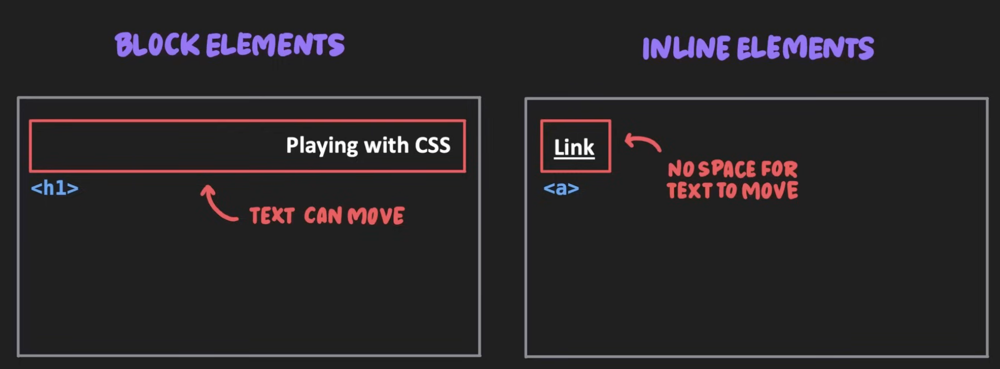
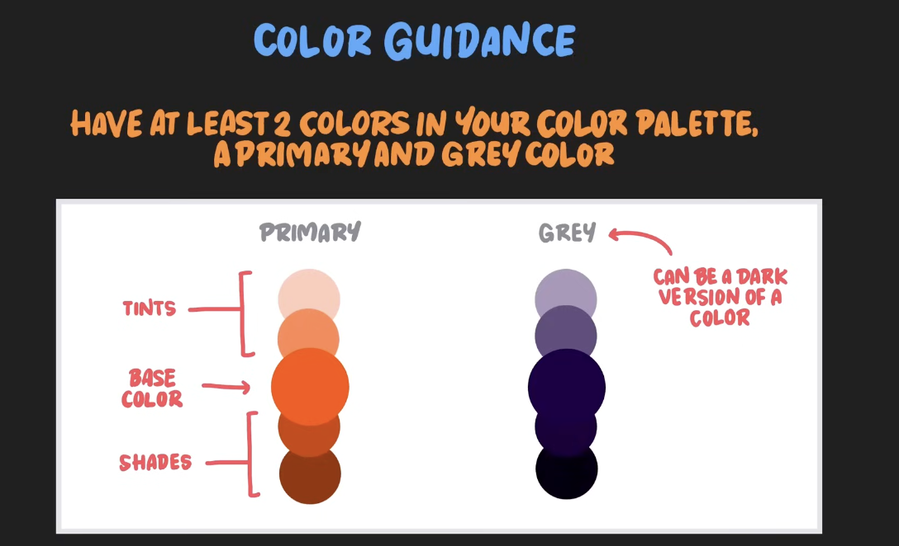

<a id="top"></a>

# 👨🏻‍🎨 HTML/CSS 

_Table of Contents:_

- [✍🏻 Topic 1: CSS Text](#-topic-1-css-text)
  - [Text Styling](#text-styling)
  - [Text Spacing](#text-spacing)
  - [Text Size](#text-size)
  - [Font Family](#font-family)
  - [Text Color](#text-color)
  - [Documentation Example](#documentation-example)
- [🪴 Topic 2: CSS Selectors](#-topic-2-css-selectors) 
  - [The Type Selectors & The Cascade](#the-type-selectors--the-cascade)
  - [Grouping Selectors](#grouping-selectors)
  - [ID & Class Selectors](#id--class-selectors)
  - [Pseudo-class Selectors](#pseudo-class-selectors)
  - [Combinator Selectors](#combinator-selectors)
  - [Specificity](#specificity)
  - [Inheritance](#inheritance)
  - [Pseudo-elements Selectors](#pseudo-elements-selectors)

## ✍🏻 Topic 1: CSS Text

In this topic we will learn about some text properties such as styling, spacing,
family, color, and size.

### Text Styling

- _Font Weight:_ it sets the thickness of the character. In CSS, `font-weight` is
  a property and `bold` is a value (i.e. `font-weight: bold`). Although you can
  use name values like `bold` or `normal`, it is better to use numerical values
  which range from `100 - 900`. Note that for value `<= 400` the value is normal
  while `500` and `600` are for medium weights and anything above `700` is `bold`.
  
  __Font-weight guidance:__ Headings should be between 500-900 while normal text
  should be 300-400. This high contrast in the font-weight will make the headings
  draw more attention.
- _Text Decorative:_ it sets decorative lines on text. The property name is
  `text-decoration` and its values include:
  - _Line value:_ `none`, `underline`, `overline`, `line-through`
  - _Color value:_ `named`, `hex`, `rgb`
  - _Style value:_ `double`, `dotted`, `wavy`, `solid`, `dashed`
  
  An example of this can be:
  ```css
  text-decoration: underline red dotted;
  ```
  Not recommended to use, unless you want to remove the default `underline` value
  on anchor links.
- _Font Style:_ it sets the style of a font. Its values include: `normal`, `italic`,
  `oblique`, `oblique 10deg`. It can sometimes be used to draw attention.
- _List Style:_ it sets the style of the list. Its values include:
  - `none`: Always us this for structural purposes (e.g. navigation bar)
  - `disc`
  - `circle`
  - `square`
  - `decimal`: This is the default for order list.
  
For summary card, check out the following asset, page 6 [⇲](<./assets/CSS Summary Cards.pdf>)

🚀 [Back to top](#top)

### Text Spacing

- _Text Align:_ specifies the horizontal alignment of text within an element.
  There are 4 values to choose from: `left`, `right`, `center`, and `justify`.
  But note that, only <ins>block</ins> text can move around, because it takes all
  the horizontal space of the screen. You can take a look at this picture
  
  _Text align guidance:_ Don't justify text, long block of text should be left-
  aligned and do not center large blocks of text.
- _Line height:_ sets the height of text and is commonly used to set distance
  between multiple lines of text. The signature is as follows:
  ```css
  // There are several types of values: unitless, percentage, pixels, ems
  line-height: 1.5; 
  ```
  Headings should be `< 1.5` and regular text should be `1.5-2` to improve 
  readability.
- _Letter spacing:_ sets the horizontal space between characters. The signature
  is
  ```css
  // There are 3 main units that can be used: pixels (most common), percentage, and ems.
  letter-spacing: 8px;
  ```
  We __often__ apply a small negative px value to headings to improve readability,
  which is commonly called _tightening_.

Summary card for this section can be found on page 7 [⇲](<./assets/CSS Summary Cards.pdf>)

🚀 [Back to top](#top)

### Text Size

- _Font Size:_ sets the font size of the text. The values can be set to be either
  __static__ or __relative__. Let's first know the signature of the property:
  ```css
  font-size: 16px; // Static value.
  ```
  - __Absolute units:__ size is fixed and does not change in relation to parent
    elements. The units to be used are flexible:
    - px (most commonly used)
    - pt, in, cm, mm
  - __Relative units:__ size is based on the size of the parent element and adjusts
    proportionally to changes in the parent elements. Some units for the values are:
    - %, em, rem, vh, vw

  __Font Size Guidance:__ It is recommended that regular text should be `16px-32px`
  and headings can be `>60px`. We can use a type-scale [⇲](typescale.com)
  which provides a structured hierachy of font sizes to create visual consistency
  and limits choices.

Summary card for this section can be found on page 7 [⇲](<./assets/CSS Summary Cards.pdf>)

🚀 [Back to top](#top)

### Font Family

- _Typeface:_ There are 5 types - serif, sans-serif, monospace, cursive, and display.
  - Serif: A classic feel used by brands to communicate __luxury__ and __reliability__.
    They are mostly used by _high-end companies_.
  - Sans-serif: A modern and clean feel used by brands to communicate __simplicity__
    and __clarity__. Thus, they are used by many _tech companies_.
  - Monospace: A technical feel used by brands to communicate __accuracy__ and
    __precision__. Usually, they are used for very technical products.
  - Cursive: A personal feel used to connect with people on a more emotional level.
    Some web pages related to weddings or blogs often use cursive.
- _Font Family:_ sets a prioritized list of font names (typeface) or font categories.
  ```css
  //            1st choice
  font-family: 'Tahoma', sans-serif;
  //                     Fall-back
  ```
  Consider the above piece of code, the way it works is that fonts will only display
  if they are installed on local machines.
  
  __Font guidance:__ Select 1 or 2 fonts, no more.
  
  _Google Fonts_ are available online and do not rely on the fonts installed on
  an individual user's device.

Summary card for this section can be found on page 8 [⇲](<./assets/CSS Summary Cards.pdf>)

🚀 [Back to top](#top)

### Text Color

- _CSS Color:_ specifies the color of text. Its signature is as follows
  ```css
  color: #9874F9;
  ```
  
  The value for the `color` property can have different units:
  - hex (most commonly used)
  - rgb, rgba, hsl
  
  __Color Guidance:__ Have at least 2 colors in your color palette, a primary and
  grey color.
  
  Primary colors are used to highlight important parts of a page (e.g. buttons). 
  Tints and shades can be used to create contrast, which are often used for fonts.
  
  A great place to explore colors and choose you palette is [tailwind colors](https://tailwindcss.com/docs/colors).
  
Summary card for this section can be found on page 8 [⇲](<./assets/CSS Summary Cards.pdf>)

🚀 [Back to top](#top)

### Documentation Example

```css
/// Documentation on properties used in project.
/// 
/// +----------------------/ Typography /----------------------+
/// | 
/// | FONT SIZES:
/// | 12px / 16px / 20px / 24px / 32 px / 40px / 48px / 60px
/// | 
/// | FONT WEIGHTS:
/// | 400 / 700
/// | 
/// | LINE HEIGHT
/// | 1.2 / 1.5
/// | 
/// | LETTER SPACING
/// | 0 / -2px
/// | 
/// | FONT FAMILY
/// | Poppins
/// |
/// +----------------------------------------------------------+
/// 
/// +----------/ COLORS /----------+
/// | 
/// | PRIMARY
/// | Base: #339af0 (Sky Blue)
/// | Tint: #d0ebff (Arctic)
/// | Shade: #1c7ed6 (Deep Sea)
/// | 
/// | SECONDARY
/// | Base: #9775fa (Lavendar)
/// | Tint: #e5dbff (Moonligh Iris)
/// | Shade: #7048e8 (Velvet Night)
/// | 
/// | TERTIARY
/// | Base: #ff922b (Pumpkin)
/// | Tint: #ffe8cc (Dawn)
/// | Shade: #f76707 (Lava)
/// | 
/// | GREY
/// | Base: #495057 (Slate)
/// | Tint: #f1f3f5 (Pebble)
/// | Shade: #212529 (Graphite)
/// | White: #ffffff (White)
/// | Black: #000000 (Black)
/// | 
/// +------------------------------+
///
/// +---------- BORDER RADIUS ----------+
/// | 
/// | 4px / 8px / 20px
/// | 
/// +-----------------------------------+
/// 
/// +----------------------------- SPACING SYSTEM -----------------------------+
/// | 
/// | 5px / 10px / 15px / 20px / 25px / 30px / 40px / 50px / 60px / 70px / 80px /
/// | 90px / 100px / 125px / 150px / 200px / 250px / 300px / 400px / 500px
/// | 
/// +--------------------------------------------------------------------------+
```

## 🪴 Topic 2: CSS Selectors

### The Type Selectors & The Cascade

- _Type Selector:_ selects elements based on their tag name. For example,
  ```css
  h1 {
    font-size: 20px;
    color: orange;
  }
  ```
  __Type Selector Guidance:__ It is useful for setting global styles to ensure
  consistency.
- _The Cascade:_ styles declared later will take priority. For example,
  ```css
  h1 {
    color: blue;
  }
  h1 {
    color: green; // This is declared later, so this will take effect.
  }
  ```
  
Summary card for this section can be found on page 10 [⇲](<./assets/CSS Summary Cards.pdf>)

🚀 [Back to top](#top)

### Grouping Selectors

- Selectors can be comma separated to apply shared styles.
  ```css
  h1 {
    color: blue;
  }
  h2 {
    color: blue;
  }
  // The above piece of code can be combined into
  h1, h2 {
    color: blue;
  }
  ```
- _Grouping selectos and cascading_
  ```css
  h1 {
    font-size: 62px;
    color: #495057;
  }
  h2 {
    font-size: 48px;
    color: #495057;
  }
  
  // Since the color property is the same, we can use CSS cascade to write the
  // following piece of code.
  
  h1, h2 {
    color: #495057;
  }
  h1 {
    font-size: 62px;
  }
  h2 {
    font-size: 48px;
  }
  ```

Summary card for this section can be found on page 10 [⇲](<./assets/CSS Summary Cards.pdf>)

🚀 [Back to top](#top)

### ID & Class Selectors

- _The ID selector_ selects an element based on an uniqe ID attribute and can
  only be used once. 
- _The class selector_ selects one or more elements based on a __class__ attribute
  that can be used multiple times.

For example, consider the following html code
```html
<body>
  <p id="red-text"> Copper mug</p>
  <p class="blue-text">Hello</p>
  <p class="blue-text">World</p>
</body>
```
Then, we can use ID and Class selectors to style as follows
```css
p {
  color: yellow;
}
#red-text { // ID selector
  color: red;
}
.blue-text { // Class selector
  color: blue;
}
```

__Selector Guidance:__ 

- Classes are often preferred over IDs because they offer greater flexibility and 
  reusability.
- It is common to use __type selectors__ for global styles and __class selectors__
  for more specific visual styles.
- Classes for components are designed to be combined on a single HTML element for
  a modular approach to styling. For example,
  ```css
  .btn {
    display: inline-block;
    text-decoration: none;
    padding: 1.5rem 3 rem;
    border-radius: 8px;
    font-size: 1.6 rem;
  }
  .btn-primary {}
  .btn-secondary {}
  ```
  Then in html, we can use these class as follows,
  ```html
  <a href="/" class="btn btn-primary">Press Me!</a>
  ```

Summary card for this section can be found on page 10 [⇲](<./assets/CSS Summary Cards.pdf>)

🚀 [Back to top](#top)

### Pseudo-class Selectors

Pseudo-classes defines styles for a specific state or condition of an HTML element.
The signature is a keyword with a colon added to the end of a selector.

- __State__ pseudo-classes: dynamic styling based on user interaction & commonly 
  used for hyperlinks.
  - `a:link` targets __anchor tags__ that have _not_ yet been visited.
  - `a:visited` targets __anchor tags__ that have been visited.
  - `a:hover` targets an element when the cursor is placed over it.
  - `a:active` targets an element when it is being clicked. However, this pseudo-
    class is not commonly used.

  __State pseudo-classes guidance:__ it is best practice to style the pseudo-classes
  of anchor tags instead of styling the anchor element directly.

  ```css
  // bad practice - does not cover all states.
  a {
    color: orange;
  }
  // good practice
  a:link, a:hover {
    color: orange;
  }
  ```
  Another example of bad-good practice:
  ```css
  // bad practice
  .btn {
    color: purple;
  }
  // good practice
  .btn:link, .btn:visited {
    color: purple;
  }
  ```
- __Conditional__ pseudo-classes: styling based on an element position in relation
  to other elements.
  - `li:first-child` targets the first child element.
  - `li:last-child` targets the last child element.
  - `li:nth-child(n)` targets child elements based on their position.

Summary card for this section can be found on page 11 [⇲](<./assets/CSS Summary Cards.pdf>)

🚀 [Back to top](#top)

### Combinator Selectors

Combining two or more selectors to target elements based on their positions
relative to each other.

- `div p` __all__ descendant (child) selector
- `div > p` __direct/first__ descendant (child) selector
- `h1 + p` adjacent (sibling) selector
- `h1 ~ p` General sibling selector

The 1st and 2nd are used the most.

Summary card for this section can be found on page 11 [⇲](<./assets/CSS Summary Cards.pdf>)

🚀 [Back to top](#top)

### Specificity

Summary card for this section can be found on page 11 [⇲](<./assets/CSS Summary Cards.pdf>)

🚀 [Back to top](#top)

### Inheritance

Properties set on parent elements are passed to their children by default. 

_But what gets inherited?_

It is mainly text properties that are inherited from parent to child. Those are
`color`, `font-weight`, `line-height`, `font-family`, `font-style`, `text-align`,
`font-size`, `letter-spacing`, `text-transform`.

__Inheritance & Specificity guidance:__ Global font styles are set on the body element so that
all child text elements inherit styles by default.
```css
body {
  color: black;
  font-weight: 400;
  font-family: Arial, sans-serif;
}

// Override
h1 {
  color: blue;
  font-weight: 700;
  font-size: 52px;
}
```

__Inheritance & Text-Align__ <!--Youtube video at 3:44:57-->

### Pseudo-elements Selectors

## Resources

- [CSS in 5 minutes](https://www.youtube.com/watch?v=Z4pCqK-V_Wo)
- [Detailed CSS course on Youtube (Part 1)](https://youtu.be/-G-zic_LS0A?si=sooerJXNCADr5Jte)
- [Detailed CSS course on Youtube (Part 2)](https://youtu.be/1ra4yeyjFFc?si=J16lp3yHj1lIzkvx)
